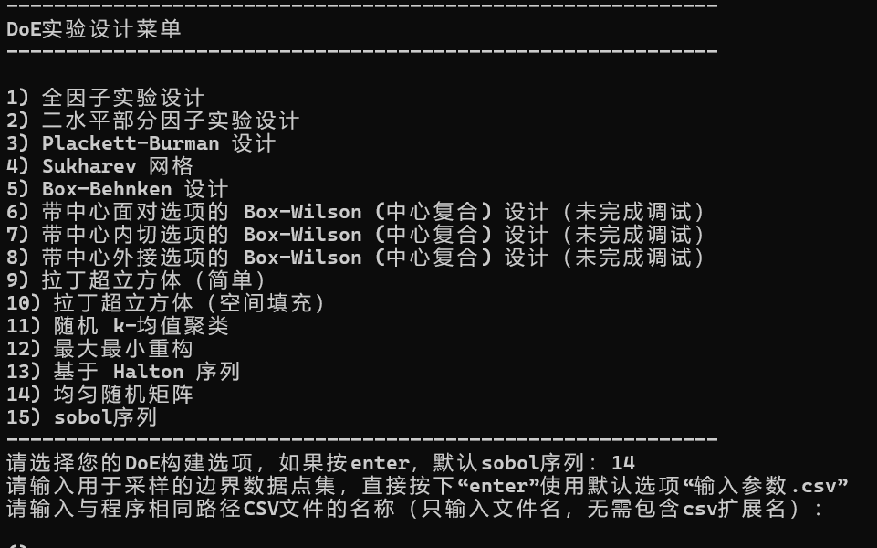

# DoE_sample

中文版DoE实验设计自动采样程序（虚拟实验设计师），拥有15种采样算法，都是正确的，部分仍为开发完成。专为中国科研人员设计。


## 

## 使用方法

修改“输入参数.csv”或者自定义一个csv文件（但是要放在文件夹内），CSV的第二行为最小值、第三行为最大值，每一列可以写入多种不同特征。

首先下载项目：

```bash
git clone https://github.com/66my/DoE_sample.git
```

你需要有一个conda安装环境文件，当然，自己配置本地 base 环境也可以：

```bash
conda env create -f environment.yml
```


上面这个步骤，你也可以运行`win_install_conda_environment.bat`文件，在windows 系统将自动下载 Miniconda 安装程序并创建环境，环境名称为doe_sample。


在新的环境下，运行

```bash
python main.py
```

首先输入序号，1到15代码不同的算法，部分算法为调通，别介意；

输入采样点；

生成结束。

### 生成文件位置

文件夹：DOE实验输出

命名格式：“输入参数” + 算法类型名称 + 采样点个数 + “.csv”

## 其他

程序截图：



